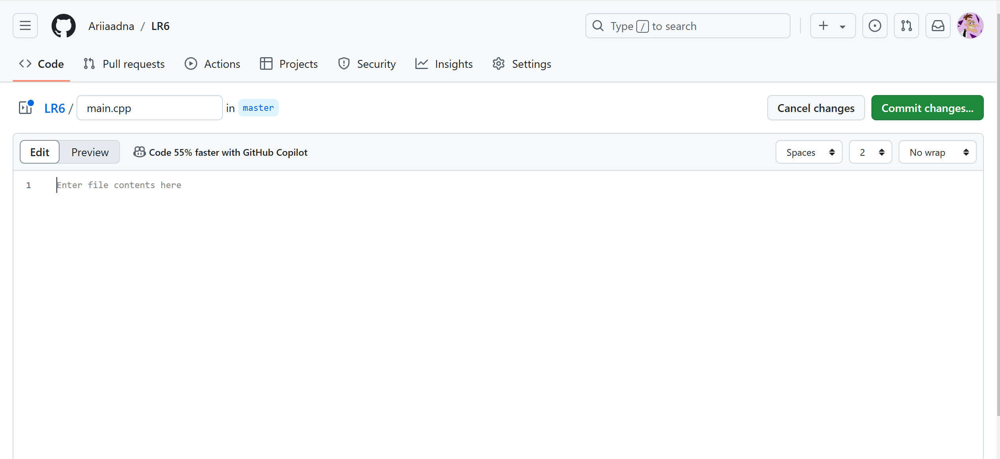

# LR6
Лабораторная работа №6

# Отчет по работе с Git

## 1. Создание форка
*Скриншот с созданием форка*  


## 2. Установка Git
*Скриншот с процессом установки git*  


## 3. Изменение имени пользователя
Команда для изменения имени пользователя:

```bash
$ git config --global user.name "4317 Чёрненькая Ариадна"
```

## 4. Клонирование репозитория

```bash
$ git clone https://github.com/Ariiaadna/LR6
```

## 5. Добавление нового файла
*Скриншет с добавлением нового файла*


## 6. Добавление изменений в локальный репозиторий

```bash
$ git pull
```


## 7. Получение данных для каждой из веток

```bash
$ git log --all –oneline
```

*Результат работы команды*


## 8. Просмотр последних изменений

```bash
$ git log -1
```

*Результат работы команды*


## 9. Решение конфликта и слияние веток

```bash
$ git checkout master
$ git merge branch1
```

Открыл merge.txt с помощью nano и изменил содержимое файла

```
nano merge.txt
```

## 10. Удаление побочной ветки после слияния

```bash
$ git branch -d branch1
```

## 11. Откат коммита
Посмотреть логи с помощью команды:

```bash
$ git log --all –oneline
```

Откат к предыдущему коммиту:

```bash
$ git reset --hard dacac80
```

## 12. Создание ветки для отчета

```bash
$ git checkout -b report
```


## 13. Получение истории операций в форматированном виде

```bash
$ git log --pretty=format:"%h %ad %an %s" --date=short
```

## 14. История операций
Список истории операций:
+ 921f53b 2024-11-14 Ариадна Чёрненькая. Merge branch 'branch1'
+ 28b47a0 2024-11-14 Ариадна Чёрненькая Create main.cpp
+ 921f53b 2020-11-21 Kurtyanik Обновление информации
+ c08a654 2020-11-21 Kurtyanik Файл создан пустым
+ 3c6e913 2020-11-21 Kurtyanik Initial commit
